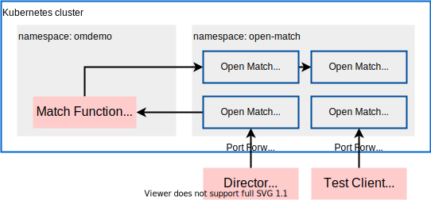

# Open Match Local Development example

A Local development example for [Open Match](https://open-match.dev).



## Requirements

- [minikube](https://github.com/kubernetes/minikube)
- [skaffold](https://github.com/GoogleContainerTools/skaffold)
- Go 1.16
- GNU Make

## Install

```
make up
```

## Usage

```sh
make dev # make Match Function up
make test
```

