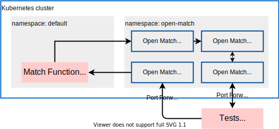

# Open Match Local Development example

A Local development example for [Open Match](https://open-match.dev).



## Prerequisites

- GNU Make
- [aqua](https://aquaproj.github.io/)

## Usage

```sh
aqua i  # Set-up CLI tools
make up  # Set-up kubernetes cluster
make dev # make Match Function up
make test
make down  # Tear-down the cluster
```
